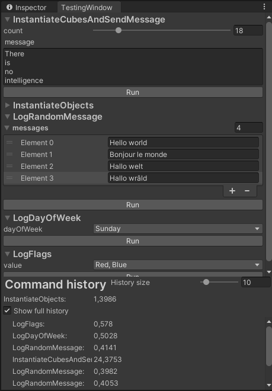

# TestingWindow for Unity Editor
The window can invoke methods and show elapsed time in milliseconds
<p align="left">
  
</p>

## How to use
Just use `[TestingCommand]` attribute with some static method to be able to invoke it from the window

```csharp
using UnityEngine;
using TestingWindow;

public class SomeClass
{
    [TestingCommand]
    private static void SendMessage(string message)
    {
        Debug.Log(message);
    }
}
```

Be aware that the first calls may be slower

### Timer
You can manually start and stop the timer where you need to
```csharp
using TestingWindow;

public class SomeClass
{
    [TestingCommand]
    private static void Test1(string message)
    {
        //Something
        TestingTimer.Start();
        //Something
    }

    [TestingCommand]
    private static void Test2()
    {
        //Something
        TestingTimer.Stop();
        //Something
    }

    [TestingCommand]
    private static void Test3()
    {
        //Something
        TestingTimer.Start();
        //Something
        TestingTimer.Stop();
        //Something
    }
}
```

## Supported types
int, long, float, double, string, enum

Unity's:
Bounds, BoundsInt, Color, AnimationCurve, Gradient, Rect, RectInt, Vector2, Vector2Int, Vector3, Vector3Int, Vector4

Types inherited from UnityEngine.Object
