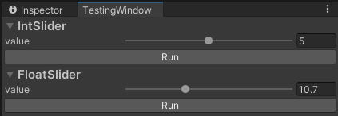

# TestingWindow for Unity Editor
The window can invoke methods and show elapsed time in milliseconds
<p align="left">
  
</p>

## How to use
Just use `[TestingCommand]` attribute with some static method to be able to invoke it from the window

```csharp
using UnityEngine;
using TW;

public class SomeClass
{
    [TestingCommand]
    private static void SendMessage(string message)
    {
        Debug.Log(message);
    }
}
```

Be aware that the first calls may be slower

### Timer
You can manually start and stop the timer where you need to
```csharp
using TW;

public class SomeClass
{
    [TestingCommand]
    private static void Test1(string message)
    {
        //Something
        TestingTimer.Start();
        //Something
    }

    [TestingCommand]
    private static void Test2()
    {
        //Something
        TestingTimer.Stop();
        //Something
    }

    [TestingCommand]
    private static void Test3()
    {
        //Something
        TestingTimer.Start();
        //Something
        TestingTimer.Stop();
        //Something
    }
}
```

### DisplayAs attribute
Multiline strings
```csharp
using TW;

public class SomeClass
{
    [TestingCommand]
    [DisplayAs("text", Display.TextArea)]
    private static void StringTest(string text)
    {

    }
}
```
<p align="left">
  
</p>

Sliders
```csharp
using TW;

public class SomeClass
{
    [TestingCommand]
    [DisplayAs("value", 4, 6)]
    private static void IntSlider(int value)
    {

    }

    [TestingCommand]
    [DisplayAs("value", -2f, 34.3f)]
    private static void FloatSlider(float value)
    {

    }
}
```
<p align="left">
  
</p>

Path <br>
Allows you to use windows explorer to select a file/folder
```csharp
using TW;

public class SomeClass
{
    [TestingCommand]
    [DisplayAs("filePath", Display.PathFile)]
    [DisplayAs("directoryPath", Display.PathDirectory)]
    private static void Path(string filePath, string directoryPath)
    {

    }
}
```

## Supported types
AnimationCurve, Bounds, BoundsInt, Color, Gradient, Hash128, Quaternion, Rect,
RectInt, Vector2, Vector2Int, Vector3, Vector3Int, Vector4, Matrix4x4, UnityEngine.Object,
bool, byte, sbyte, short, ushort, int, uint, long, ulong, float, double, char, string

Arrays and lists of all types above

Types inherited from UnityEngine.Object,
enums and enums with [Flags] attribute
